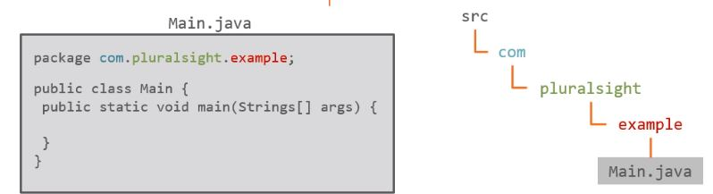
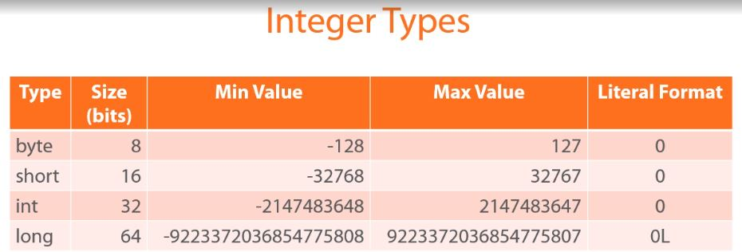
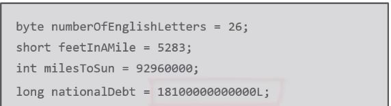
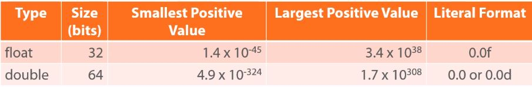
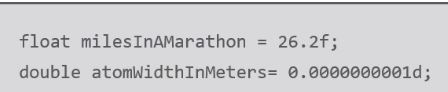
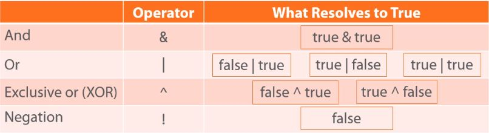
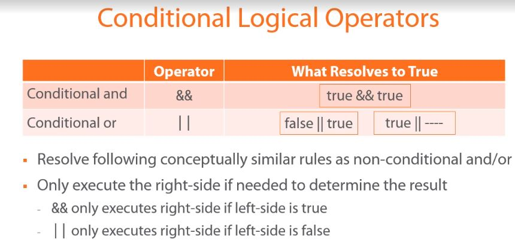

# Packages

## Advantages

- Provides organization
- Follow standard naming convention
- Affect source code file structure

## Naming conventions

- All lowercase

- User reversed domain name to assure global uniqueness, e.g

  - ```text
    from: pluralsight.com
    to: com.pluralsight
    ```

  - Add further qualifiers to assure uniqueness within a company/group, e.g:

    - ```text
      com.pluralsight.mycompany
      ```


## Structure



# Primitive Data types

## Integer types



### Examples



## Floating Point Types




### Example



# Conditional Logic, Looping, and Arrays

## Conditional Assignment

Assign a value to a variable based on the result of a condition

### Structure

```text
result = condition ? true-value: false-value;
```

### Example

```java
int v1 = 7;
int v2 = 5;

int vMax = v1 > v2 ? v1: v2;
```

## Block Statements and Variable Scope

A variable declared within a block is not visible outside of the block.

A variable's range of visibility is know as the variable's scope


e.g:

```java
if (someCondition){
    int value = 1;
}

System.out.println(value); // we have a compilation error
```

## Logical Operators



| Notes

- And: executes both sides to resolve it
- Or: executes both sides to resolve it

## Conditional Logical Operators

