# Introduccion

Se desarrollo un projecto web con la finalidad de conectarlo con una base de datos en `mysql.`

Las tecnologias usadas para este proyecto fueron las siguientes:

| #    | Tecnologia | Descripcion                                                  | Logotipo                                      |
| ---- | ---------- | ------------------------------------------------------------ | --------------------------------------------- |
| 1    | Java       | Java es un lenguaje de programación y una plataforma informática comercializada por primera vez en 1995 por Sun Microsystems. Hay muchas aplicaciones y sitios web que no funcionarán a menos que tenga Java instalado y cada día se crean más. Java es rápido, seguro y fiable :point_right: [Mas informacion aqui](https://www.java.com/es/download/faq/whatis_java.xml) | 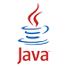        |
| 2    | JavaScript | Javascript es un lenguaje con muchas posibilidades, utilizado para crear pequeños programas que luego son insertados en una página web y en programas más grandes, orientados a objetos mucho más complejos :point_right: [Mas informacion aqui](http://www.maestrosdelweb.com/que-es-javascript) |  |
| 3    | Bootstrap  | [Bootstrap](http://getbootstrap.com/) es un [framework](http://jordisan.net/blog/2006/que-es-un-framework/) desarrollado y liberado por Twitter que tiene como objetivo **facilitar el diseño web** :point_right:[Mas informacion aqui](https://puntoabierto.net/blog/que-es-bootstrap-y-cuales-son-sus-ventajas​) |    |
| 4    | HTML       | HTML es un lenguaje de programación que se utiliza para el desarrollo de páginas de Internet. Se trata de la siglas que corresponden a HyperText Markup Language, es decir, Lenguaje de Marcas de Hipertexto :point_right: [Mas informacion aqui](https://codigofacilito.com/articulos/que-es-html) |              |
| 5    | CSS        | Es un lenguaje que define la apariencia de un documento escrito en un lenguaje de marcado (por ejemplo, [HTML](http://www.arumeinformatica.es/dudas/html)) :point_right: [Mas informacion aqui](​http://www.arumeinformatica.es/dudas/css) |                |

# Desarrollo

## Escalabilidad y confiabilidad

Este proyecto fue desarrollado con un sistema de control de versiones (:link: [git](https://git-scm.com/book/es/v1/Empezando-Fundamentos-de-Git)​) el cual permite en resumidas palabras tener control sobre los cambios de codigo realizados a lo largo del projecto. Se utilizo este sistema ya que permite escalabilidad y confiabilidad al momento de desarrollar software

## Creacion de tablas e insercion de datos

Para esta parte del desarrollo, el siguiente codigo se utilizo para la creacion de tablas e insercion de datos en `MySQL`

:point_right: [Creacion de tablas con MySQL](https://github.com/PythonDarkeningSchool/java/blob/master/uteg/bootstrap_v4.3/README.md#tables-creation)

:point_right: [Insercion de datos con MySQL](https://github.com/PythonDarkeningSchool/java/blob/master/uteg/bootstrap_v4.3/README.md#data-insert)

## Estructura del projecto

En github el projecto esta estructurado como se muestra a continuacion

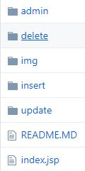

### La carpeta `admin`

Esta carpeta contiene los siguientes archivos

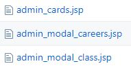

:page_facing_up: `admin_cards.jsp` *=>* Este archivo contiene las siguientes vistas las cuales pertenencen al tab `Admin`

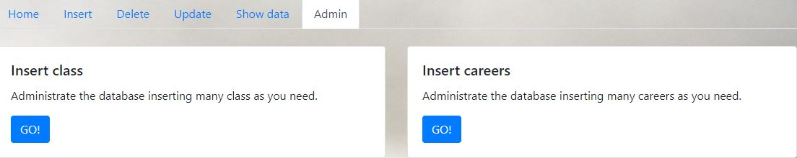 

El codigo que contiene es el siguiente :floppy_disk: [Ver en github](https://github.com/PythonDarkeningSchool/java/blob/master/uteg/bootstrap_v4.3/web/admin/admin_cards.jsp)​

:page_facing_up: `admin_modal_careers.jsp` *=>* Este archivo contiene el modal cuando se invoca al boton `GO!`

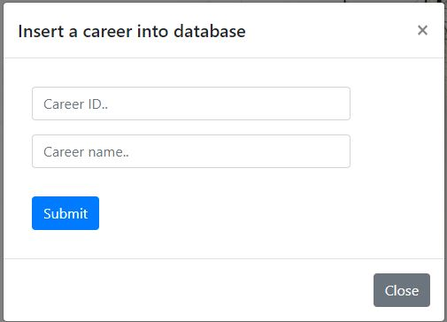

El codigo que contiene es el siguiente :floppy_disk: [Ver en github](https://github.com/PythonDarkeningSchool/java/blob/master/uteg/bootstrap_v4.3/web/admin/admin_modal_careers.jsp)

:page_facing_up: `admin_modal_class.jsp` *=>* Este archivo contiene el modal cuando se invoca al boton `GO!`

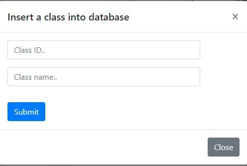

El codigo que contiene es el siguiente :floppy_disk: [Ver en github](https://github.com/PythonDarkeningSchool/java/blob/master/uteg/bootstrap_v4.3/web/admin/admin_modal_class.jsp)

### La carpeta `delete`

Esta carpeta contiene los siguientes archivos:

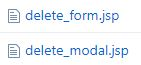

:page_facing_up: `delete_modal.jsp` *=>* Este archivo contiene el modal que se invoca cuando se presiona el boton `GO!`

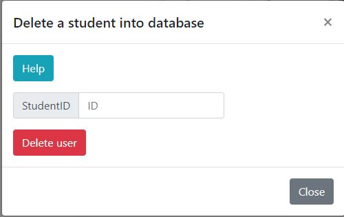

El codigo que contiene es el siguiente :floppy_disk: [Ver en github](https://github.com/PythonDarkeningSchool/java/blob/master/uteg/bootstrap_v4.3/web/delete/delete_modal.jsp)

:page_facing_up: `delete_form.jsp` *=>* Este archivo contiene el formulario dentro del modal que se invoca cuando se presiona el boton `GO!`, la imagen es la misma que la anterior

El codigo que contiene es el siguiente :floppy_disk: [Ver en github](https://github.com/PythonDarkeningSchool/java/blob/master/uteg/bootstrap_v4.3/web/delete/delete_form.jsp)

### La carpeta `img`

Esta carpeta contiene todas las imagenes necesarias para desplegar nuestro sitio web las cuales son

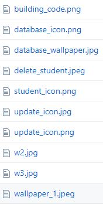

### La carpeta `insert`

Esta contiene los siguientes archivos:

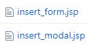

:page_facing_up: `insert_modal.jsp` *=>Este archivo contiene el modal que se invoca cuando se presiona el boton `GO!* 

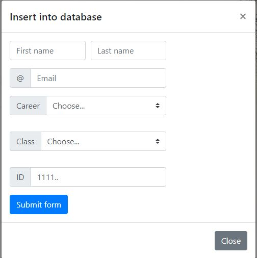

El codigo que contiene es el siguiente :floppy_disk: [Ver en github](https://github.com/PythonDarkeningSchool/java/blob/master/uteg/bootstrap_v4.3/web/insert/insert_modal.jsp)

:page_facing_up: `insert_form.jsp` *=>* Este archivo contiene el formulario dentro del modal que se invoca cuando se presiona el boton `GO!`, la imagen es la misma que la anterior

El codigo que contiene es el siguiente :floppy_disk: [Ver en github](https://github.com/PythonDarkeningSchool/java/blob/master/uteg/bootstrap_v4.3/web/insert/insert_form.jsp)

### La carpeta `update`

Esta contiene los siguientes archivos:

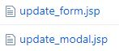

:page_facing_up: `update_modal.jsp` *=>Este archivo contiene el modal que se invoca cuando se presiona el boton `GO!* 

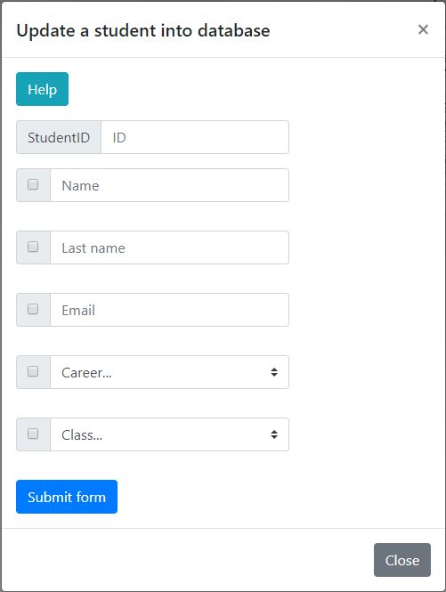

El codigo que contiene es el siguiente :floppy_disk: [Ver en github](https://github.com/PythonDarkeningSchool/java/blob/master/uteg/bootstrap_v4.3/web/update/update_modal.jsp)

:page_facing_up: `update_form.jsp` *=>* Este archivo contiene el formulario dentro del modal que se invoca cuando se presiona el boton `GO!`, la imagen es la misma que la anterior

El codigo que contiene es el siguiente :floppy_disk: [Ver en github](https://github.com/PythonDarkeningSchool/java/blob/master/uteg/bootstrap_v4.3/web/update/update_form.jsp)

## Servidor web

El servidor utilizado para este proyecto fue `Apache Tomcat` en su version *7.0.93*

| Servidor      | Descripcion                                                  | Pagina Oficial                               | Imagen                                                   |
| ------------- | ------------------------------------------------------------ | -------------------------------------------- | -------------------------------------------------------- |
| Apache Tomcat | **Apache Tomcat** (también llamado **Jakarta Tomcat** o simplemente **Tomcat**) funciona como un contenedor de *servlets* desarrollado bajo el [proyecto Jakarta](https://es.wikipedia.org/wiki/Proyecto_Jakarta) en la [Apache Software Foundation](https://es.wikipedia.org/wiki/Apache_Software_Foundation). Tomcat implementa las especificaciones de los servlets y de [JavaServer Pages](https://es.wikipedia.org/wiki/JavaServer_Pages) (JSP) de [Oracle Corporation](https://es.wikipedia.org/wiki/Oracle_Corporation) (aunque creado por [Sun Microsystems](https://es.wikipedia.org/wiki/Sun_Microsystems)). | [Apache Web Page](http://tomcat.apache.org/) |  |

## Base de datos

La base de datos utilizada en este proyecto fue `MySQL` debido a su gran popularidad y facilidad de uso

| Base de datos | Descripcion                                                  | Pagina oficial                          | Imagen                                     |
| ------------- | ------------------------------------------------------------ | --------------------------------------- | ------------------------------------------ |
| MySQL         | MySQL es un sistema de administración de bases de datos (*Database Management System, DBMS*) para bases de datos relacionales | [MySQL Web Page](https://www.mysql.com) |  |

## Herramientas

La herramienta usada en este proyecto fue `USBWebServer` por su facilidad de uso, ya que para los sistemas operativos Windows es portable.

Que es USBWebServer?

Es una combinacion de populares softwares como: Apache, MySQL, PHP y phpMyAdmin. Con esta herramienta es posible mostrar tus sitios web en `PHP` asi como en `JSP` en donde sea.

Sitio oficial: :link: [USB WebServer](https://www.usbwebserver.net/webserver)​