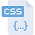

# Introduccion

Se desarrollo un projecto web con la finalidad de conectarlo con una base de datos en `mysql.`

Las tecnologias usadas para este proyecto fueron las siguientes:

| #    | Tecnologia | Descripcion                                                  | Logotipo                                      |
| ---- | ---------- | ------------------------------------------------------------ | --------------------------------------------- |
| 1    | Java       | Java es un lenguaje de programación y una plataforma informática comercializada por primera vez en 1995 por Sun Microsystems. Hay muchas aplicaciones y sitios web que no funcionarán a menos que tenga Java instalado y cada día se crean más. Java es rápido, seguro y fiable :point_right: [Mas informacion aqui](https://www.java.com/es/download/faq/whatis_java.xml) |         |
| 2    | JavaScript | Javascript es un lenguaje con muchas posibilidades, utilizado para crear pequeños programas que luego son insertados en una página web y en programas más grandes, orientados a objetos mucho más complejos :point_right: [Mas informacion aqui](http://www.maestrosdelweb.com/que-es-javascript) |  |
| 3    | Bootstrap  | [Bootstrap](http://getbootstrap.com/) es un [framework](http://jordisan.net/blog/2006/que-es-un-framework/) desarrollado y liberado por Twitter que tiene como objetivo **facilitar el diseño web** :point_right:[Mas informacion aqui](https://puntoabierto.net/blog/que-es-bootstrap-y-cuales-son-sus-ventajas​) |    |
| 4    | HTML       | HTML es un lenguaje de programación que se utiliza para el desarrollo de páginas de Internet. Se trata de la siglas que corresponden a HyperText Markup Language, es decir, Lenguaje de Marcas de Hipertexto :point_right: [Mas informacion aqui](https://codigofacilito.com/articulos/que-es-html) |              |
| 5    | CSS        | Es un lenguaje que define la apariencia de un documento escrito en un lenguaje de marcado (por ejemplo, [HTML](http://www.arumeinformatica.es/dudas/html)) :point_right: [Mas informacion aqui](​http://www.arumeinformatica.es/dudas/css) |                |

# Desarrollo

## Escalabilidad y confiabilidad

Este proyecto fue desarrollado con un sistema de control de versiones (:link: [git](https://git-scm.com/book/es/v1/Empezando-Fundamentos-de-Git)​) el cual permite en resumidas palabras tener control sobre los cambios de codigo realizados a lo largo del projecto. Se utilizo este sistema ya que permite escalabilidad y confiabilidad al momento de desarrollar software

## Estructura del projecto

