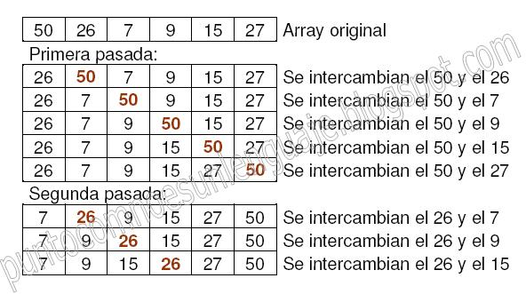
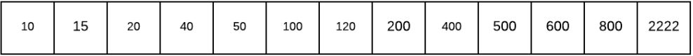

# Tabla de contenidos

- [Listas enlazadas simples](#listas-enlazadas-simples)
  * [Definicion](#definicion)
  * [Diagrama](#diagrama)
  * [Caracteristicas](#caracteristicas)
  * [Operaciones basicas](#operaciones-basicas)
- [Listas doblemente enlazadas](#listas-doblemente-enlazadas)
  * [Operaciones basicas](#operaciones-basicas-1)
  * [Algoritmo](#algoritmo)
- [Arboles](#arboles)
  * [Definicion](#definicion-1)
  * [Caracteristicas](#caracteristicas-1)
  * [Tipos de arboles](#tipos-de-arboles)
  * [Recorridos](#recorridos)
    + [Preorden](#preorden)
    + [Inorden](#inorden)
    + [Postorden](#postorden)
- [Nodos](#nodos)
  * [Declaracion de un nodo](#declaracion-de-un-nodo)
- [Algoritmo de burbuja](#algoritmo-de-burbuja)
  * [Definicion](#definicion-2)
  * [Codigo fuente](#codigo-fuente)
  * [Algoritmo](#algoritmo-1)
- [Busqueda binaria](#busqueda-binaria)
  * [Definicion](#definicion-3)
  * [Funcionamiento](#funcionamiento)
  * [Pasos a seguir](#pasos-a-seguir)
  * [Algoritmos](#algoritmos)
    + [Creando una clase desde cero](#creando-una-clase-desde-cero)
    + [Usando clases existentes](#usando-clases-existentes)
- [Fuentes](#fuentes)
- [Author](#author)


# Listas enlazadas simples

## Definicion

Las listas son estructuras de datos que permiten tener cierta flexibilidad en su manejo, pueden crecer o acortarse según se lo requiera, existen varias formas de implementar una lista en Java en este caso se presenta un ejemplo en código utilizando punteros mediante la referencia a objetos.

## Diagrama


## Caracteristicas

- El último nodo de la lista no apunta a ninguno (null).
- Se accede a la lista mediante el primer nodo o también llamado inicio de la lista.
- No tiene acceso aleatorio es decir para acceder a un valor se debe recorrer toda la lista.

## Operaciones basicas

- agregar (valor): agrega el valor al final de la lista.
- insertar (referencia, valor): inserta el valor después del valor de referencia en la lista. 
- remover (referencia): elimina el nodo con el valor que coincida con la referencia. 
- editar (referencia): actualiza el valor de nodo con el valor que coincida con la referencia.
- esVacia (): retorna true si la lista está vacía, false en caso contrario. 
- buscar (valor): retorna la true si el elemento existe en la lista, false caso contrario.
- eliminar(): elimina la lista
- listar (): imprime en pantalla los elementos de la lista.

# Listas doblemente enlazadas

Las listas doblemente enlazadas son estructuras de datos semejantes a las listas enlazadas simples.

La asignación de memoria es hecha al momento de la ejecución.

En cambio, en relación a la listas enlazada simple el enlace entre los elementos se hace gracias a dos punteros (uno que apunta hacia el elemento anterior y otro que apunta hacia el elemento siguiente).


El puntero **anterior** del primer elemento debe apuntar hacia `NULL` (el inicio de la lista).

El puntero **siguiente** del último elemento debe apuntar hacia `NULL` (el fin de la lista).


Para acceder a un elemento, la lista puede ser recorrida en ambos sentidos:

- comenzando por el inicio, el puntero **siguiente** permite el desplazamiento hacia el próximo elemento.

- comenzando por el final, el puntero **anterior** permite el desplazamiento hacia el elemento anterior.


## Operaciones basicas

- **Insertar**: inserta un nodo con dato x en la lista, pudiendo realizarse esta inserción al principio o final de la lista o bien en orden.
- **Eliminar**: elimina un nodo de la lista, puede ser según la posición o por el dato.
- **Buscar**: busca un elemento en la lista.
- **Localizar**: obtiene la posición del nodo en la lista.
- **Imprimir**: imprime los elementos de la lista


## Algoritmo

1. Se declara la clase con las siguientes variables
   1. una variable privada de tipo `int`
   2. una variable privada la cual el tipo de datos sera igual al de la clase con el nombre de la variable `siguiete`
   3. una variable privada la cual el tipo de datos sera igual al de la clase con el nombre de la variable `anterior`
2. Se declara un metodo con la palabra reservada `void`
3. Se crea y se incializa una nueva instancia de la clase del primer paso
4. Se compara si su inicio es igual a null, entonces la variable incio sera igual al objecto declarado en el paso 3
   1. De caso contrario, se llamara a un metodo de la clase creada para establecer el siguiente inicio
   2. Se establece una variable con el incio anterior
   3. se establece una variable con el objecto creado en el 3 paso


# Arboles

## Definicion

Un árbol se define como una colección de nodos donde cada uno además de almacenar información, guarda las direcciones de sus sucesores.

Los árboles representan las estructuras **no-lineales** y **dinámicas** de datos más importantes en computación.

- **Dinámicas**, puesto que la estructura árbol puede cambiar durante la ejecución de un programa.
- **No- lineales** puesto que a cada elemento del árbol pueden seguirle varios elementos.

## Caracteristicas

- **Hijo**: Es aquel nodo que siempre va a tener un nodo antecesor o padre, son aquellos que se encuentran en el mismo nivel
- **Padre**: Es aquel que tiene hijos y también puede tener o no antecesores.
- **Hermano**: Dos nodos son hermanos si son apuntados por el mismo nodo, es decir si tienen el mismo padre.
- **Raíz**: Es el nodo principal de un árbol y no tiene antecesores.
- **Hoja** o terminal: Son aquellos nodos que no tienen hijos o también los nodos finales de un árbol.
- **Interior**: Se dice que un nodo es interior si no es raíz ni hoja.
- **Nivel de un nodo**: Se dice que el nivel de un nodo es el numero de arcos que deben ser recorridos, partiendo de la raíz para llegar hasta el.
- **Altura del árbol**: Se dice que la altura de un árbol es el máximo de los niveles considerando todos sus nodos.
- **Grado de un nodo**: se dice que el grado de un nodo es el número de hijos que tiene dicho nodo.

## Tipos de arboles

- **Árboles Binarios:** Un árbol binario es un conjunto finito de elementos, el cual está vacío o dividido en tres subconjuntos separados: raíz del árbol, subárbol izquierdo y subárbol derecho
- **Árbol de búsqueda binario auto-balanceable:** Es el que intenta mantener su *altura*, o el número de niveles de nodos bajo la raíz, tan pequeños como sea posible en todo momento, automáticamente
- **Árboles AVL:** están siempre equilibrados de tal modo que para todos los nodos, la altura de la rama izquierda no difiere en más de una unidad de la altura de la rama derecha o viceversa.
- **Árboles Rojo-Negro :** Un árbol rojo-negro es un árbol binario de búsqueda en el que cada nodo tiene un atributo de color cuyo valor es **rojo** o **negro**.
- **Árboles AA:** utilizado para almacenar y recuperar información ordenada de manera eficiente
- **Árbol de segmento:** es una estructura de datos en forma de árbol para guardar intervalos o segmentos. Permite consultar cuál de los segmentos guardados contiene un punto.
- **Árboles Multicamino:** es un árbol ordenado cuyos nodos deben tener un número específico de hijos.
- **Árboles B:** Es un árbol de búsqueda que puede estar vacío o aquel cuyos nodos pueden tener varios hijos, existiendo una relación de orden entre ellos.

## Recorridos

### Preorden

1. Visitar la **Raíz**
2. Recorrer el subarbol **izquierdo**
3. Recorrer el subarbol **derecho**


### Inorden

1. Recorrer el subarbol **izquierdo**
2. Visitar la **raíz**
3. Recorrer el subarbol **derecho**


### Postorden

1. Recorrer el subarbol **izquierdo**
2. Recorrer el subarbol **derecho**
3. Visitar la **raíz**


# Nodos

## Declaracion de un nodo

Paso 1:  Suponiendo que se tiene la clase NodoSimple

```java
public class NodoSimple {
 
	public String nombre;
	public String apellido;
 
	public NodoSimple siguienteNodo;
 
| La estructura que mantiene la cola unida es un objeto del mismo tipo de la clase. En este caso la clase se llama NodoSimple y la estructura que mantiene la union de la cola NodoSimple.
```

Paso 2: Creacion de nodos

```java
NodoSimple nodo1 = new NodoSimple();
nodo1.nombre = "Noel";
nodo1.apellido = "Valdez";
 
NodoSimple nodo2 = new NodoSimple();
nodo2.nombre = "Pedro";
nodo2.apellido = "Picapiedra";
nodo2.siguienteNodo = null;
```

Paso 3: Union de nodos

```java
nodo1.siguienteNodo = nodo2;
```


# Algoritmo de burbuja

## Definicion

El **algoritmo de la burbuja** es uno de los métodos de ordenación más conocidos y uno de los primeros que aprenden los programadores. 

Consiste en comparar pares de elementos adyacentes en un array y si están desordenanos intercambiarlos hasta que estén todos ordenados.

Si A es el array a ordenar, se realizan A.length-1 pasadas. Si la variable i es la que cuenta el número de pasadas, en cada pasada i se comprueban los elementos adyacentes desde el primero hasta A.length-i-1 ya que el resto hasta el final del array están ya ordenados. Si los elementos adyacentes están desordenados se intercambian.


## Codigo fuente

```java
public static void burbuja(int[] A) {
        int i, j, aux;
        for (i = 0; i < A.length - 1; i++) {
            for (j = 0; j < A.length - i - 1; j++) {
                if (A[j + 1] < A[j]) {
                    aux = A[j + 1];
                    A[j + 1] = A[j];
                    A[j] = aux;
                }
            }
        }
}
```


En tiempo de ejecucion el programa anterior quedaria de la siguiente manera:



## Algoritmo

1. Declaramos una lista
2. Declaramos un elemento iterable (for) para iterar sobre todos los elementos de la lista de izquierda a derecha
3. Declaramos otro elemento iterable (for) anidado con el del paso anterior con la condicion de que nunca llegue al ultimo elemento de la lista (`ya que se supone que este ya esta ordenado`)
4. En el for del paso anterior declaramos una condicion de tipo booleana donde indica que si el elemento siguiente es mayor que el elemento actual entra en esta condicion
   1. Declaramos una variable de tipo `int`para almacenar el valor del elemento siguiente
   2. En la celda siguiente de la lista insertamos el actual elemento
   3. En la celda actual de la lista insertamos el siguiente elemento

| Notas

- El tiempo de ejecución del algoritmo de la burbuja es del orden O(n2)
- Es uno de los peores algoritmos de ordenación en cuanto a tiempo de ejecución, solamente es recomendable su uso para ordenar listas con un número pequeño de elementos.


# Busqueda binaria

## Definicion

El algoritmo de búsqueda binaria funciona sobre arreglos ordenados y es utilizado para buscar un elemento en los mismos.


## Funcionamiento

El funcionamiento del algoritmo es simple y cuenta con las siguientes partes:

- Datos de entrada :
  - Un arreglo ordenado
  - Un valor a buscar en el arreglo
- Datos de salida:
  - La posición del elemento en el arreglo o -1 en caso de no encontrarlo

## Pasos a seguir

El algoritmo de búsqueda binaria sigue los siguientes pasos:

- Verifica si el elemento a buscar es menor al máximo elemento en el arreglo y mayor al mínimo elemento del arreglo, en caso de no ser así  se devolverá -1 ya que sabemos que no se encuentra el elemento.
- Obtiene el elemento que se encuentra en la mitad del arreglo y lo compara con el valor que se busca.
- En caso de que el elemento sea mayor al valor que se busca se descartará la parte derecha y se volverá a ejecutar la misma validación pero solo sobre el lado izquierdo del arreglo.
- El paso anterior se repetirá hasta encontrar el elemento
- En caso de no encontrar el elemento se devolverá -1 para indicar que no se encontró.


## Algoritmos

### Creando una clase desde cero


Suponiendo que se tiene el siguiete arreglo de ejemplo y el valor a buscar es *400*, los pasos para obtener el algoritmo es el siguiente:



1. Se declara un array de tipo `int` con sus datos ordenados
2. Se obtiene la mitad del arreglo con la siguiente ecuacion: `límite inferior + límite superior)/2` (el valor obtenido en este paso es *120*)
3. Se evalua si el valor del paso 2 es mayor o menor al numero que buscamos
   1. si es menor el valor se encuentra al lado izquierdo del arreglo
   2. si es mayor el valor se encuentra del lado derecho del arreglo
   3. Por consecuente uno de los dos lados sera descartado, en este caso sera el lado izquierdo
4. Se divide el arreglo nuevamente, pero ahora  su limite inferior sera de 200
   1. La formula quedaria asi: arreglo[valorObtenidoPaso2 + 1] + limite superior
   2. Dada la formula del paso anterior, el nuevo valor de en medio sera *500*
   3. Se evalua nuevamente si *400* es mayor o menor al valor obtenido en el paso `4.2` , lo cual si lo es y la parte derecha del arreglo sera descartada
5. Se divide nuevamente el arreglo con la ecuacion del paso 2, y con esto obtendremos el numero buscado ya que la ecuacion dara como resultado el numero buscado.

### Usando clases existentes

1. Se importa la clase `java.utils.Arrays`

2. Se crea un arreglo ordenado

3. Se declara una variable del tipo `int` como *array* y se inicializa con una lista ordenada

4.  Se declara una variable del tipo `int` y se incializa llamando al metodo de la clase antes importada de la siguiente manera:  

   1. ```java
      Arrays.binarySearch(<ArrayABuscar>, <valorBuscado>);
      ```

5. Se imprime el resultado del paso 4


# Fuentes

:link: [Listas enlazadas simples](http://codigolibre.weebly.com/blog/listas-simples-en-java)

:link: [Listas enlazadas dobles](http://coodigob.blogspot.com/2013/03/listas-enlazadas-dobles.html)

:link: [Arboles en Java](https://blog.michelletorres.mx/arboles-en-java)

:link: ​[Nodos en Java](https://www.lawebdelprogramador.com/foros/Java/853466-Nodos-Java.html)

:link: ​[Metodo de la burbuja](http://puntocomnoesunlenguaje.blogspot.com/2012/07/metodo-de-ordenacion-burbuja.html)

:link: ​[Busqueda binaria](https://devs4j.com/2018/02/02/busqueda-binaria-en-java-paso-a-paso)

# Autor

Humberto Israel Perez Rodriguez - UTEG

Ingeneria en Computacion

